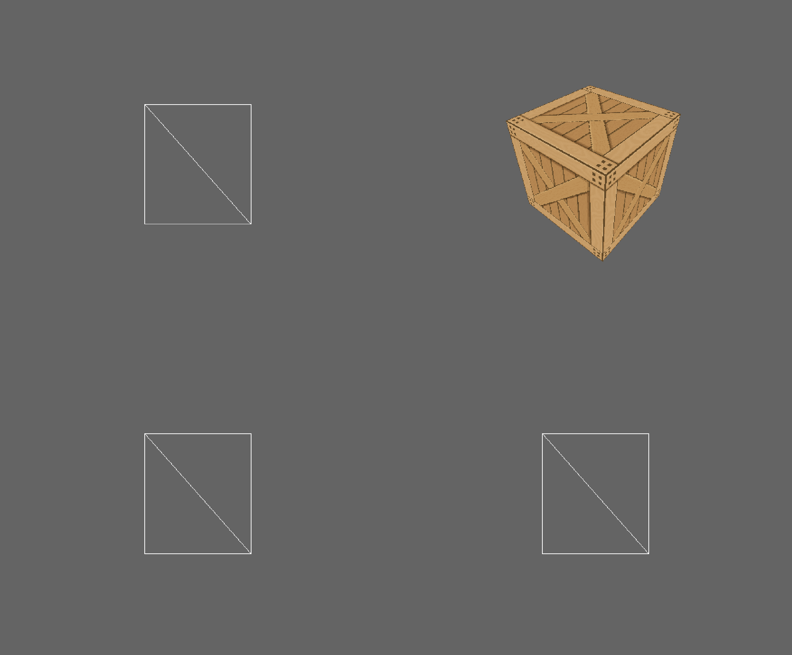

# JuiceBox
_0.4.55_

A lofi 3d modelling app that replicates similar aesthetics to the Playstation.

## Main Features
- Model Editing
- Texture Painting

### UI
- Menu bar
  - File
      - New
      - Load
      - Save
      - Exit
  - Options
      - Lighting
      - Rendering
- Selection (buttons)
  - Vertex
  - Edge
  - Face
- Viewports
  - [x] top/bottom
  - [x] front/back
  - [x] right/left
  - [x] model
- Transformation (buttons)
  - Rotate
  - Scale
  - Translate
- Creation (buttons)
  - Add new mesh (cube, sphere etc)
  - Loop cut
  - Subdivide
  - Extrude
  - Inset
- Removal
  - Delete vertex (context menu)
  - Delete edge (context menu)
  - Delete face (context menu)

### Model Editing
- Selection
  - [x] Vertex
  - [x] Edge
  - [x] Face
- Transformations
  - Rotate
  - Scale
  - Translate
- Creation
  - Loop cut
  - Subdivide
  - Extrude
  - Inset
- Removal
  - Delete vertex
  - Delete edge
  - Delete face
- Usability
  - Undo/Redo

### Texture Painting
- Select face
- Move vertex, edge or face (UVs)
- Paint on model
- Set texture size 32x32, 64x64, 128x128, 256x256
- Colour pallete picker
- Brush size
