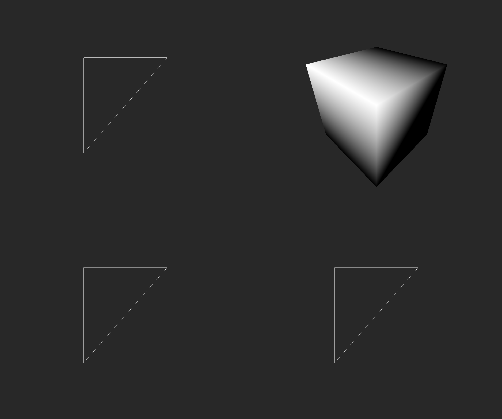

# JuiceBox
_0.1.18_

A lofi 3d modelling app that replicates similar aesthetics to the Playstation.

## Main Features
- Model Editing
- Texture Painting

### Model Editing
- Selection
  - Vertex
  - Edge
  - Face
- Transformations
  - Rotate
  - Scale
  - Translate
- Creation
  - Loop cut
  - Subdivide
  - Extrude
  - Inset
- Removal
  - Delete vertex
  - Delete edge
  - Delete face
- Usability
  - Undo/Redo

### Texture Painting
- Select face
- Move vertex, edge or face (UVs)
- Paint on model
- Set texture size 32x32, 64x64, 128x128, 256x256
- Colour pallete picker
- Brush size
